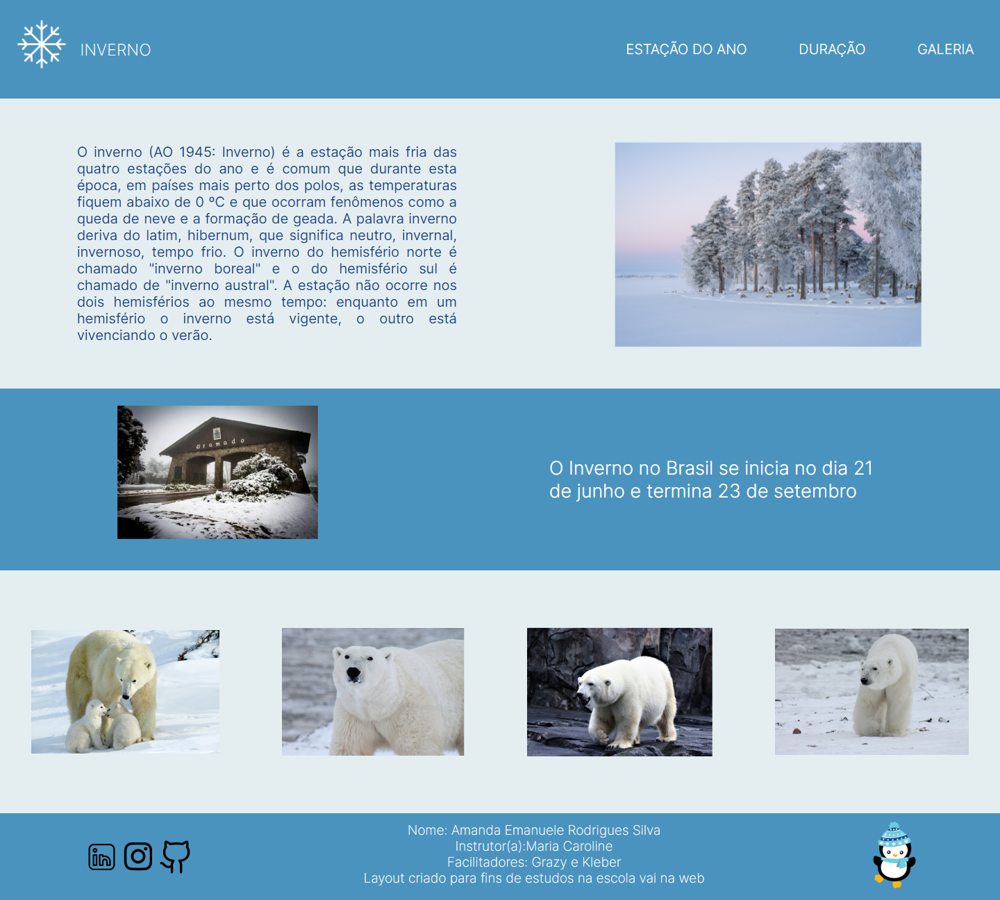

<h1 align="center">
❄💻<Desafio - Inverno>
</h1>
Esse é um desafio proposto pelo curso de Front-end oferecido pelo  <a href = "https://vainaweb.com.br/">Vai na web.</a>
O desafio tinha como objetivo criar um clone de um projeto desenvolvido pelos instrutores do Vai na web pelo figma, nele foi possível aplicar os conceitos ensinados ao longo das aulas. Este projeto é uma página temática dedicada a estação do ano inverno.

## Visão geral 
O desafio de inverno é um site com design simples desnvolvido apenas com HTML e Css, oferencendo algumasinformações sobre o inverno.

## Funcionalidades 
- **Estação do ano: Algumas informações sobre o inverno, a previsão do tempo em algumas regiões e os destinos mais populares de inverno.
- **Duração: O período do ano, mês e dia, quando começa e termina a estação.
-- ** Galeria: Algumas imagens de árvores cobertas de neve, florestas geladas e ursos polares.

## 💼 Tecnologias utilizadas

Para o desenvolvimento deste site utilizei as seguintes tecnologias:
- HTML;
- CSS;
- Figma
- GIT e Github